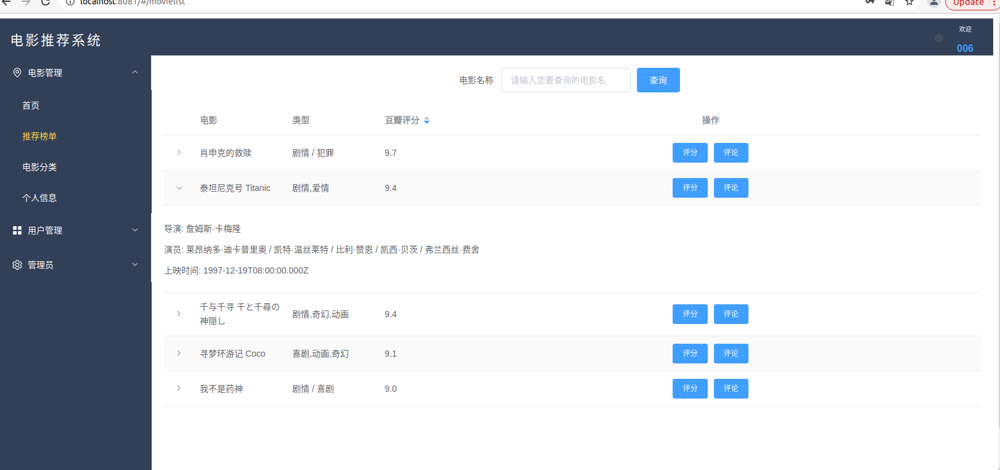

# 基于nodejs+vue+express+mongodb实现的电影推荐系统

### 1.项目设计部分

##### 1.1  项目总体构成：

管理员：管理员可以进行用户管理，上传电影和榜单的管理；

用户：用户通过注册登陆后可以查看推荐榜单，模糊查询电影名称，按照分类查询，对电影进行评分和评价，查看个人信息；

##### 1.2  引入的包的说明：

（1）express : 基于node.js的后端开发框架；

（2）mongoose：操作mongodb；

（3）vue：交互前端框架；

（4）element-plus：前端样式，方便快捷，简化流程；

（5）axios：拦截请求和响应，转换请求数据和响应数据，取消请求，自动转换json数据；

（6）bcrypt：加密工具，加密注册的密码，登录时解密；

（7）jsonwebtoken：创建token，保存登陆的用户信息；

（8）jwt-decode：解析token；

（9)   nodemon：检测项目中的所有文件，一旦发现文件有改动，nodemon会重启；

（10）concurrently：同时运行前后端的命令；

（11）passport ：提供了易于实现的各种不同的请求身份验证策略，和jwt一起验证用户身份

（12）passport-jwt：和passport一起验证token；

（13）core-js：使用API；

（14）vue-router：ue前端的路由；

（15）vuex：管理vue的状态；

（16）mddir：生成项目目录；

##### 1.3  项目目录结构和各个部分的说明

（1）项目目录和说明

|-- movie                             //	项目总名称

​    |-- .gitignore

​    |-- package-lock.json         

​    |-- package.json                //	项目配置

​    |-- server.js                      //	项目入口文件

​    |-- client                            //	前端文件夹

​    |   |-- .gitignore

​    |   |-- README.md

​    |   |-- babel.config.js

​    |   |-- package-lock.json    

​    |   |-- package.json               

​    |   |-- vue.config.js                   // 	可选的配置文件，配置跨域等

​    |   |-- public                              

​    |   |   |-- favicon.ico

​    |   |   |-- index.html

​    |   |-- src                                  // 	前端的源码目录

​    |       |-- App.vue                    //	根组件

​    |       |-- main.js                    // 	入口js文件

​    |       |-- assets                                  // 	资源目录，这里的资源会被webpack构建

​    |       |   |-- 1.jpg							

​    |       |   |-- 2.jpg

​    |       |   |-- 3.jpg

​    |       |   |-- bj.jpg

​    |       |   |-- logo.png

​    |       |-- components 						//	公共组件目录，创建vue项目时原生创建

​    |       |-- router									//	前端路由文件

​    |       |   |-- index.js						  

​    |       |-- store									//	应用级数据

​    |       |   |-- index.js

​    |       |   |-- types.js

​    |       |-- views								//	页面目录				

​    |           |-- Home.vue                 	  //	首页页面

​    |           |-- Index.vue						//	导航框架

​    |           |-- Login.vue						// 登录页面

​    |           |-- Movie.vue						//	更新榜单页面

​    |           |-- Movieadd.vue				// 	上传电影页面

​    |           |-- Movieclass.vue			 //	电影分类页面

​    |           |-- Movielist.vue				//	推荐榜单页面

​    |           |-- Register.vue				//	用户注册页面

​    |           |-- Userinfo.vue				//	用户信息页面

​    |           |-- Userlist.vue				//	用户管理页面

​    |-- config										//	项目配置

​    |   |-- key.js									

​    |   |-- passport.js

​    |-- doc											//	项目文档

​    |   |-- readme.md						//	项目说明书

​	|-- node_modules						//	项目依赖的包		

​    |-- models									//	数据库模型

​    |   |-- db.js									//	连接mongodb

​    |   |-- movie.js							//	电影

​    |   |-- um.js								//	用户电影

​    |   |-- user.js							//	用户

​    |-- routers								//	后端接口

​        |-- api									//	api接口文件

​            |-- movies.js					//	关于电影的后端接口

​            |-- ums.js						//	关于用户交互的后端接口

​            |-- users.js					 //	关于用户的后端接口

（2）项目目录

### 2.使用说明书

##### 2.1	用户登录

在本地环境下输入http://localhost:8081/#/login，进入用户登录页面，输入用户名和密码点击登录，成功后跳转到首页。（没有账号还可点击注册跳转到注册页面）登录成功后在右上角会显示当前登录的用户名。

##### 2.2	用户注册

在用户注册表单内输入信息，注册成功后跳转到登录页面进行登录。

##### 2.3	推荐榜单

用户登录后，可以查看推荐的电影榜单，点击可以查看详细信息。

豆瓣评分可以根据高低进行筛选。

##### 2.4	电影搜索

在搜索框内输入电影关键词可以查询到对应的信息

##### 2.5	评分评价

点击评分按钮，点亮星星对该电影进行评分。

点击评论按钮，输入评论提交。

##### 2.6	电影分类

进入页面后是全部类型，之后可以点击你想选择的分类进行筛选。

点击喜剧后页面为：

##### 2.7	个人信息

在该页面可以查看到自己的注册信息以及进行过的评价评分。

点击删除按钮还可以对评价或评分进行删除。

##### 2.8	用户管理（管理员）

只有管理员登录才能看到全部的用户列表，普通用户无法查看。

点击删除按钮可对用户进行删除。

##### 2.9	上传电影（管理员）

只有管理员可以进行上传。

##### 2.10  更新榜单（管理员）

管理员进入后可以看到全部的电影列表，并进行编辑和删除工作。

点击编辑按钮，可以对当前电影进行修改编辑。

点击删除，可以删除当前电影。

##### 2.11	退出

点击右上角的下拉菜单，点击个人信息可以跳转到个人信息页面，查看个人信息。

点击退出，便可退出当前登录，返回登录页面。

##### 2.12	右侧导航

点击便可跳转到上述页面。

### 3.开发日记

12.19 开始查找资料，定选题；

12.21 创建movietest，全天进行创建试错，最后晚上准备重新开始；

12.22 创建movie，安装express、mongoose等，创建github项目，编写后端相应接口；晚上创建vue 前端文件，但是跨域出现问题，改了很久未能成功；

12.23 发现路径问题，前后台终于连接！！！安装element等组件，实现登录和注册的功能！

12.25 完善各个页面和功能连接；

12.26 继续完善并改bug，（位置一定要放对，不然会出问题！）

12.27	大致完成全部的功能，增删修改，包括管理员的一些功能和用户评分评论等功能的实现；

12.28 	美化了登录和注册页面，创建首页，完善项目说明书；电影上传的页面些许简单，卡片不能居中，便想将上传和更新合成电影管理，但是出现错误，我便又该了回去，导致页面不是很美观。希望明天部署一切顺利！

